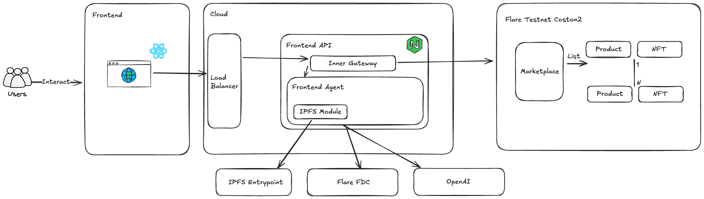

# NexAgreement

NexAgreement is a decentralized marketplace for digital products using smart contracts and NFTs for ownership verification.

## Project Overview

This platform enables:
- Listing digital products with NFT ownership
- Secure transactions through smart contracts
- Royalty payments to original creators
- Decentralized ownership verification
- Cross-chain transaction attestation via Flare Data Connector

## Project Structure

The project consists of two main components:

### `/nexagreement` - Frontend Application

Next.js web application with:
- Product browsing and search
- Listing creation interface
- Wallet integration
- User dashboard

Tech stack:
- Next.js 15.3.0
- React
- Tailwind CSS
- ethers.js for blockchain interaction

### `/smart_contracts` - Blockchain Smart Contracts

Solidity contracts implementing:
- Factory pattern for product creation
- NFT standard for ownership
- Secure payment system
- Royalty mechanism

Tech stack:
- Solidity 0.8.20
- Hardhat development environment
- OpenZeppelin contracts
- TypeScript for testing

## System Architecture



The NexAgreement platform uses a multi-layered architecture:

1. **Frontend Layer**:
   - React/Next.js web application
   - Directly interacts with users
   - Connects to cloud services through API endpoints

2. **Cloud Infrastructure**:
   - Load Balancer: Manages incoming traffic and routes requests
   - Frontend API & Inner Gateway: Handles API requests and authentication
   - Frontend Agent: Core processing logic with specialized modules:
     - IPFS Module: For decentralized storage of agreements and metadata
     - Connects to external services including Flare FDC and OpenAI

3. **Blockchain Layer** (Flare Testnet Coston2):
   - Marketplace smart contracts for product listing and transactions
   - Products represented as smart contracts with ownership verification
   - NFTs for digital asset ownership with royalty capabilities

4. **External Services**:
   - IPFS Entrypoint: For decentralized storage of agreements and product metadata
   - Flare Data Connector (FDC): Provides cross-chain transaction attestation
   - OpenAI: Used for agreement generation and validation

This architecture ensures:
- Decentralized storage of agreements and metadata
- Cross-chain verification using Flare's Data Connector
- Secure and transparent transactions on the blockchain
- Scalable cloud infrastructure for handling user requests

## Getting Started

### Smart Contracts

```bash
cd smart_contracts
npm install
npx hardhat compile
npx hardhat test
```

For local development:
```bash
npx hardhat node
npx hardhat run scripts/deploy.js --network localhost
```

### Frontend

```bash
cd nexagreement
npm install
npm run dev
```

The application will be available at http://localhost:3000

## Architecture

1. **Product Creation Flow**:
   - User creates listing through UI
   - ProductFactory contract deploys new Product contract
   - NFT is minted representing ownership

2. **Purchase Flow**:
   - Buyer initiates purchase through UI
   - Smart contract handles payment including royalties
   - NFT ownership is transferred to buyer
   - Transaction is verified through Flare Data Connector
   - Digital agreement is generated with attestation link

3. **Flare Data Connector Integration**:
   - Provides cross-chain attestation of transactions
   - Enhances trust with verifiable transaction proofs
   - Attestation links included in generated agreements
   - Uses Flare's decentralized oracle network for verification

## Development

For detailed development instructions, see:
- [Frontend README](/nexagreement/README.md)
- [Smart Contracts README](/smart_contracts/README.md)

## License